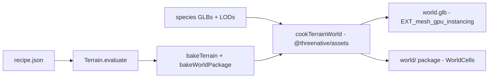

# PRD-583 — A Strata world bakes headlessly into an instanced GLB

**Status:** NOT STARTED
**Priority:** P1 — No headless path turns a Strata recipe into a GLB with its trees and rocks; PRD-584's agent handoff cannot start without AC-1 to AC-4.
**Complexity:** 5 (MEDIUM); risk override: none
**Owner:** ThreeNative maintainers
**Depends on:** None
**Parent:** [PRD-466](../done/PRD-466-strata-terrain-threejs-integration.md), [PRD-468](../done/PRD-468-strata-world-controls-and-asset-imports.md)
**Epic:** [Strata terrain hardening](README.md)

## Context

The owner's goal for Strata (2026-10-05): another agent says "I am making an xyz game, generate a W
terrain" and gets "a glb or something ready to use". Audit of `2d2124792` (2026-10-10) found three
gaps on that path:

- `exportWorldGLB` (`packages/terrain/src/export.ts`) needs browser `FileReader` and canvas
  (`packages/terrain/README.md`), so a Node job or an MCP server cannot call it.
- The same encoder rejects instancing: `export.ts:167-169` throws "resolve skinning/instancing
  into static meshes first". A forest of 10 000 trees becomes 10 000 mesh nodes, so 10 000 draws
  in the consumer.
- `bakeWorldPackage` (`packages/terrain/src/core/world-package.ts:221`) is headless and writes
  `heightmap.u16`, `placements.bin`, `splat.rgba` and `world.json`, but no GLB, no LOD and no
  cell proxy. The legacy `makeExport(..., "glb")` holds terrain geometry only.

The cook in `@threenative/assets` already holds every piece this needs, in Node: gltf-transform
(`packages/assets/package.json:49-51`), the `EXT_mesh_gpu_instancing` compaction
(`packages/assets/src/passes/compact.ts:104`), meshopt simplification (`modelPass({ simplify })`)
and the per-cell HLOD proxy (`packages/assets/src/world/proxy.ts`).

## Solution

Add one cook entry in `@threenative/assets` (it carries the glTF dependencies the terrain package
must not inherit): `cookTerrainWorld({ state, species, out })`.

1. Terrain: `bakeTerrain(state)` chunks become GLB meshes with the kit's PBR layer maps, written as
   image bytes that already exist (JPG/PNG/KTX2). No canvas, no `FileReader`.
2. Scatter: each species GLB is read once. Placements of one species and one LOD become one node
   with `EXT_mesh_gpu_instancing`. LOD levels come from the species' own `*-mid`/`*-lod1` GLBs when
   present, else from `modelPass({ simplify })`.
3. Output: `world.glb` (single file, loads in vanilla `GLTFLoader`) and the existing world package
   directory with the species GLBs and LODs filled in, for `WorldCells` streaming.
4. Every placement samples the baked heightmap. A tree whose base misses the ground by more than
   one heightmap texel fails the cook by name (catches a flipped Z or transposed grid; audit H4).

`exportWorldGLB` stays the browser editor's encoder for now. When the cook is the one path the
editor uses too, it is deleted (PRD-588 decides).

## Acceptance Criteria

- [ ] AC-1 [local]: `cookTerrainWorld` runs under plain Node 22 with no DOM globals and writes `world.glb` for the forest kit. proof: `pnpm exec vitest run packages/assets/__tests__/terrain-world.spec.ts` — Evidence: pending.
- [ ] AC-2 [local]: Each species-and-LOD pair is one `EXT_mesh_gpu_instancing` node; node count does not grow with tree count. proof: same spec, glTF node census at 1 000 and 10 000 trees — Evidence: pending.
- [ ] AC-3 [local]: A vanilla three `GLTFLoader` loads `world.glb` into `InstancedMesh` objects whose instance count equals the bake's placement count. proof: `pnpm --filter strata-terrain-preview test:consumer` — Evidence: pending.
- [ ] AC-4 [local]: A placement mirrored in Z fails the cook with a named contact error. proof: spec case in `terrain-world.spec.ts` — Evidence: pending.
- [ ] AC-5 [local]: The world package written next to it passes `validateWorldPackage` and lists a GLB and at least one LOD per species. proof: `terrain-world.spec.ts` — Evidence: pending.

## Integration Ledger

| Capability | Reachable consumer/trigger | Replaces / disposition | Evidence |
|---|---|---|---|
| Headless world GLB | `cookTerrainWorld` from `@threenative/assets`; kit `bake.mjs`; PRD-584 MCP tool | Browser `exportWorldGLB` stays for the editor until PRD-588 | AC-1, AC-3 |
| Instanced scatter in GLB | Any `GLTFLoader` consumer | Per-tree mesh nodes | AC-2 |

## Execution Phases

#### Phase 1: terrain and scatter into one instanced GLB
**Status:** NOT STARTED
**Files:** `packages/assets/src/world/terrain-world.ts` (new), `packages/assets/src/index.ts`, `packages/assets/__tests__/terrain-world.spec.ts`
**Implementation:** read `bakeTerrain` chunks and placements; group by species and LOD; write `EXT_mesh_gpu_instancing` nodes with gltf-transform; pass existing image bytes through; contact check per placement.
- [ ] Node-only cook writes `world.glb`. proof: `pnpm exec vitest run packages/assets/__tests__/terrain-world.spec.ts`
- [ ] Node count is constant from 1 000 to 10 000 trees. proof: same spec
- [ ] Mirrored placements fail by name. proof: same spec

#### Phase 2: LODs and the world package
**Status:** NOT STARTED
**Files:** `packages/assets/src/world/terrain-world.ts`, `packages/terrain/starter/forest/bake.mjs`
**Implementation:** prefer authored `*-mid` / `*-lod1` GLBs; fall back to `modelPass({ simplify })`; fill `assets[].glb` and `lods` in `world.json`.
- [ ] World package validates and carries LODs per species. proof: `terrain-world.spec.ts`
- [ ] The forest kit bake emits both outputs. proof: `node packages/terrain/starter/forest/bake.mjs` then the spec's file check

#### Phase 3: consumer load
**Status:** NOT STARTED
**Files:** `examples/strata-terrain-preview/scripts/verify-consumer.mjs`
**Implementation:** load the cooked `world.glb` with stock `GLTFLoader`; assert instance counts and that no mesh is a per-tree copy.
- [ ] Vanilla loader gets `InstancedMesh` with the bake's counts. proof: `pnpm --filter strata-terrain-preview test:consumer`
