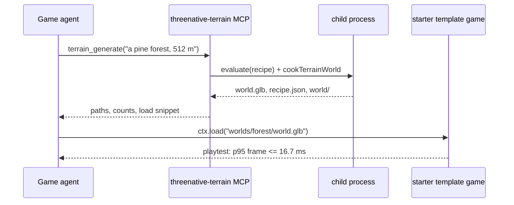

# PRD-584 — An agent asks for a forest over MCP and gets a 60 fps GLB

**Status:** NOT STARTED
**Priority:** P1 — The epic's headline outcome: no MCP tool generates terrain today, and no measured number shows a handed-over Strata world holding 60 fps (AC-1 to AC-5).
**Complexity:** 7 (HIGH); risk override: closed-list boundary — a request-to-world tool sits next to the closed "preset/genre system" item
**Owner:** ThreeNative maintainers
**Depends on:** [PRD-583](PRD-583-a-strata-world-bakes-headlessly-into-an-instanced-glb.md)
**Epic:** [Strata terrain hardening](README.md)

## Context

Owner, 2026-10-10: "the AI agent could call some MCP endpoint like terrain_generation =>
'Generate a forest for me' => and then instantly it's generated and a .glb is provided, and the
game can use it at min 60fps performance."

Today, on `2d2124792`:

- No MCP server exposes terrain. `packages/core/mcp/servers.mjs` wires `threenative-assets`,
  `-sculpt`, `-engine` and `-blender`. None of them generates terrain.
- `engine_search_capabilities("generate a forest terrain with trees and rocks for my game and
  load it as a GLB", scope "request")` returns `Heightfield`, `getWorldCapabilities` and
  `TerrainTiles` first. `exportWorldGLB` is rank 7 (score 0.28) and needs a browser.
- The forest kit's trees come from licensed local-only assets (`examples/strata-terrain-preview/AGENTS.md`).
  CI and a user machine see procedural stand-ins.
- No playtest loads a handed-over Strata world in an ordinary game and measures it. The
  preview's own FPS reflects its own renderer (owner, 2026-10-05: judge the exported world as
  an ordinary game loads it).

## Solution

A fifth core-wired MCP server, `threenative-terrain`, follows the blender pattern: a shim in
`packages/core/mcp/terrain.mjs`, registered in `MCP_SERVERS`, launching a server bundled from
`packages/terrain`. It costs nothing until a tool is called.

Tools:

- `terrain_generate({ request, sizeMeters?, seed?, out? })` — picks one starter recipe
  (`forest`, `coastal`, `alpine`, `desert`, `tundra`) from the request, sets size and seed, runs
  `Terrain.evaluate` and PRD-583's `cookTerrainWorld` in a child process with a timeout (the
  evaluator only checks `AbortSignal` between operations; `AGENT_GUIDE.md` "Bounds"), and writes
  `public/worlds/<name>/world.glb`, `recipe.json` and the world package. It returns the paths,
  triangle, instance and draw counts, and a three-line load snippet.
- `terrain_patch({ recipe, commands })` reuses the editor's command vocabulary (`upsert`,
  `update`, `remove`, `move`, `toggle`) so the agent edits the returned recipe instead of
  re-prompting.

Species GLBs are CC0. They are fetched on first use through the existing asset MCP download path
and cached, so the tool does not depend on PRD-589's tarball diet.

The return names the starter recipe it chose. The recipe is editable game data, not a hidden
preset. That keeps the CHARTER's terrain allowance ("editable terrain starter documents") and
does not add a genre system. Phase 1 adds one line to that allowance naming this tool.

The 60 fps claim is measured on a stock template game, not the preview: the starter template
loads `world.glb` with `ctx.load`, walks a fixed path, and the playtest asserts frame time.

## Acceptance Criteria

- [ ] AC-1 [local]: `tools/list` on the shipped shim lists `terrain_generate` and `terrain_patch`. proof: stdio spec beside the sculpt shim's `tools/list` test in `packages/core/__tests__` — Evidence: pending.
- [ ] AC-2 [local]: `terrain_generate({ request: "a pine forest" })` writes a `world.glb` that `GLTFLoader` loads, cold, within 60 s on the reference CPU. proof: `packages/terrain/__tests__/terrain-mcp.spec.ts` with timing — Evidence: pending.
- [ ] AC-3 [local]: `engine_search_capabilities` ranks the terrain tool or `cookTerrainWorld` first for "generate a forest for my game". proof: a case in the PRD-297 capability-recall gate — Evidence: pending.
- [ ] AC-4 [local]: The starter template loads the generated forest and holds p95 frame time ≤ 16.7 ms over a 300-frame walk on a named real GPU (WebGPU, `adapter.info` recorded). proof: `node packages/playtest/dist/runner/cli.js <terrain-forest>.playtest.json --browser-recipe webgpu` — Evidence: pending.
- [ ] AC-5 [local]: The same scenario holds p95 ≤ 16.7 ms on the native desktop host. proof: same scenario `--target desktop` — Evidence: pending.

## Blocked on

- An Android 60 fps claim needs the shared Pixel lane — unblocked by João lending the device (memory: ask for the Pixel). The emulator cannot hold a frame-time claim.

## Integration Ledger

| Capability | Reachable consumer/trigger | Replaces / disposition | Evidence |
|---|---|---|---|
| Terrain MCP server | `.mcp.json` written by installing `@threenative/core` → `mcp/terrain.mjs` | New | AC-1 |
| Request to world | `terrain_generate` → child process → `cookTerrainWorld` | Hand-run kit `bake.mjs` | AC-2 |
| Discovery | `engine_search_capabilities` | Rank 7 browser-only result | AC-3 |
| 60 fps handoff | starter template `ctx.load(world.glb)` | Preview-only FPS numbers | AC-4, AC-5 |

## Execution Phases

#### Phase 1: the tool generates a GLB
**Status:** NOT STARTED
**Files:** `packages/terrain/src/mcp/server.ts` (new), `packages/core/mcp/terrain.mjs` (new), `packages/core/mcp/servers.mjs`, `packages/core/scripts/bundle-terrain-mcp.mjs` (new), `docs/architecture/CHARTER.md`
**Implementation:** stdio MCP server; request → starter recipe by keyword with the choice returned; child process with timeout; CC0 species fetched through the asset MCP download path and cached.
- [ ] Shim lists both tools. proof: stdio `tools/list` spec
- [ ] A forest request writes a loadable GLB inside 60 s. proof: `terrain-mcp.spec.ts`

#### Phase 2: agents find it
**Status:** NOT STARTED
**Files:** `packages/terrain` capability entries, `packages/create-threenative/capabilities.json` (generated), template `AGENTS.md` terrain line
**Implementation:** capability entry with situation "generate a forest/terrain/world for my game"; template `AGENTS.md` names the tool.
- [ ] Search ranks the tool first. proof: capability-recall gate case

#### Phase 3: a stock game holds 60 fps on it
**Status:** NOT STARTED
**Files:** `packages/create-threenative/template-playtests/` (new forest scenario)
**Implementation:** scaffold the starter template, generate a forest with the tool, load it, walk 300 frames, assert p95 frame time.
- [ ] Web WebGPU p95 ≤ 16.7 ms. proof: playtest `--browser-recipe webgpu`
- [ ] Native desktop p95 ≤ 16.7 ms. proof: playtest `--target desktop`
