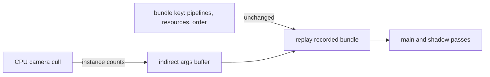

# PRD-576 — The engine renderer draws from the GPU scene

**Status:** NOT STARTED
**Priority:** P1 — `Renderer::render` is 21% of the Midway frame and the split of its about 1160 WebGPU calls per frame is unmeasured (Phase 1 open); visibility still rebuilds the recorded main pass (Phase 2 open).
**Complexity:** 5 (MEDIUM) — 1–5 engine files (+1), indirect draw arguments are a new renderer module (+2), the same change ships in the Wasm and native builds (+2); risk override: none
**Owner:** João
**Depends on:** [PRD-573](./PRD-573-the-performance-bar-is-a-scorecard-on-named-scenes.md) for the scorecard. Phase 3 reads [PRD-578](./PRD-578-the-engine-skips-work-that-did-not-change.md) Phase 2.
**Estimate:** Phase 1 ≈ 3 h; Phase 2 ≈ 16–20 h, of which the shadow-pass bundle is **3–4 h (quick win)**; Phase 3 ≈ 2 h decision, then 24–40 h if it continues.

## Context

Layer: engine (`packages/runtime-native/src/engine/renderer/` on `origin/feat/native-engine`). Draw
recording is engine work that no game can reach.

Decision 12 in `docs/architecture/NATIVE-ENGINE-DECISION.md` (on `origin/feat/native-engine`) already
sets the GPU-side design: "static draws are recorded once as render bundles; culled instances draw
indirectly". The code at `76989167f` does half of that (read 2026-10-09):

- **The main pass replays a render bundle.** `renderer.cpp:2617-2670` builds a key from every planned
  draw (pipeline, bind groups, offsets, instance count, and the handle and size of each vertex and
  index buffer) and records `mainBundle_` and `viewportBundle_` again only when the key changes. The
  comment says matrix, colour, camera and light writes keep the bundle valid. Changed draw order,
  resources or counts rebuild it. Camera culling (`renderer/visibility/camera_cull.{h,cpp}`) changes
  the plan when the camera turns, so a turning camera can rebuild the bundle each frame. The
  rebuild rate on Midway is unverified.
- **The key is rebuilt every frame.** The loop calls `geometry_.sync` for six buffer stores per
  draw before it can compare the key. Its share of `Renderer::render` is unverified.
- **The shadow pass encodes every draw directly** (`renderer.cpp:2607`, `encode(shadowPass, p,
  false)` per planned draw), with no bundle.
- **No indirect draw exists in the renderer.** The GPU-scene cull and LOD kernel
  (`world/gpu_scene/cull_kernel.{h,cpp}`, [PRD-519](../native-engine/PRD-519-n12-native-batching-visibility-lod-gpu-scene.md)
  Phase 3) writes `DrawIndexedIndirect` arguments (`world/gpu_scene/gpu_scene.h:35`,
  `kGpuSceneDrawArgsWords = 5`) for world placements only, not for the renderer's scene meshes.
- The epic brief counts about 1160 WebGPU calls per frame on the native Midway page. On the web each
  call crosses from Wasm to JS. The split by call type is unverified.

Occlusion culling stays declined ([PRD-284](../done/nanite-like/PRD-284-the-frame-does-not-draw-what-the-frame-already-hid.md),
[PRD-489](../open-world/PRD-489-gpu-scene-occlusion-culling.md): median would-cull share 0.013). This PRD
does not reopen it. Cluster LOD bands belong to PRD-519. The JS-to-Wasm call count of the game API
belongs to PRD-553.

### What Unreal does (UE 5.8.3, design reference only)

- Mesh draw commands are built once when a primitive enters the scene and cached
  (`Engine/Source/Runtime/Renderer/Private/PrimitiveSceneInfo.cpp:583` `CacheMeshDrawCommands`), and
  each frame only sorts and submits the visible ones (`Renderer/Private/MeshDrawCommands.cpp`).
- Instance culling runs on the GPU and writes indirect arguments, so visibility is data, not a
  changed command list (`Renderer/Private/InstanceCulling/InstanceCullingManager.cpp`,
  `Renderer/Private/InstanceCulling/InstanceCullingContext.cpp`, `Renderer/Private/GPUScene.cpp`).

## Solution

1. **Measure (Phase 1).** The engine counts main-bundle rebuilds and WebGPU calls by pass (shadow,
   main, upload) per frame, and the profiler reports them.
2. **The shadow pass replays a bundle** under the same key rule as the main pass. Viewport and
   scissor stay outside the bundle.
3. **Visibility becomes data.** Each bundle draw is `drawIndexedIndirect` from one arguments buffer.
   The CPU cull writes the instance count (0 for a culled draw) with one `writeBuffer` per frame,
   so the bundle key no longer holds visibility, and a turning camera does not rebuild it. Core
   WebGPU accepts a non-zero `firstInstance` in indirect arguments only with the
   `indirect-first-instance` feature, so every argument keeps `firstInstance` at 0 (the renderer
   already offsets instance data through buffer offsets). `ponytail:` a culled draw still costs one
   replayed command. If a scene culls most of its draws, the key falls back to the visible set.
4. **The GPU writes the arguments (Phase 3)**, only if CPU cull and project stay at 8% or more of the
   frame: the PRD-519 kernel is extended from world placements to the renderer's records.

## Execution Phases

#### Phase 1: The draw path is measured
**Status:** NOT STARTED
**Files:** `src/engine/renderer/renderer.{h,cpp}`, `scripts/profile-wasm-page.ts`
- [ ] The frame report carries bundle rebuilds and WebGPU calls by pass, and Midway's values over a scripted camera turn are recorded here with the load average. proof: a red-green ctest case in `ctest --test-dir packages/runtime-native/build/tn-linux -R native_engine_batched_vs_unbatched` (rebuild counter 0 on a still frame, 1 after a draw is added), then `pnpm profile:wasm-page -- --url <native Midway> --control <three.js Midway> --gpu-calls --json`

#### Phase 2: Recorded passes survive camera motion
**Status:** NOT STARTED
**Files:** `src/engine/renderer/renderer.{h,cpp}`, `tests/native-engine/renderer/` (batched-vs-unbatched cases)
- [ ] **[QW ≤4 h]** The shadow pass replays a bundle and renders the same frame to the pixel. proof: red-green case in `ctest --test-dir packages/runtime-native/build/tn-linux -R native_engine_batched_vs_unbatched` with a shadow-casting light (worst channel difference 0, shadow encode calls 0 on the second still frame)
- [ ] The shadow bundle lowers WebGPU calls per frame on Midway. proof: `pnpm profile:wasm-page -- --url <native Midway, this build> --control <native Midway, base build> --gpu-calls` with subject/control calls per frame below 1.0 (a counter gate)
- [ ] Main and shadow draws read their instance counts from an indirect arguments buffer, and a camera turn over a still scene rebuilds no bundle. proof: red-green case in the same ctest (a 90-degree turn over 60 frames: rebuilds 0, every frame equal to the direct-draw frame)
- [ ] Midway's frame CPU busy falls against its base build with the indirect path. proof: `pnpm profile:wasm-page -- --url <native Midway, this build> --control <native Midway, base build> --cpu-work --gpu-calls` with subject/control CPU busy below 1.0

#### Phase 3: The GPU writes the arguments, if earned
**Status:** NOT STARTED
**Files:** `src/engine/world/gpu_scene/cull_kernel.{h,cpp}`, `src/engine/renderer/renderer.cpp`, `src/engine/renderer/visibility/camera_cull.cpp`
- [ ] The decision is recorded under `## Decisions`: continue only if `ProjectedCull::apply` and `RenderDatabase::project` together stay at 8% or more of the Midway frame after Phase 2 and PRD-578 Phase 2. proof: `pnpm profile:wasm-page -- --url <native Midway> --control <three.js Midway> --cpu-work`
- [ ] The kernel writes the renderer's instance counts, the visible set equals `CameraCull`'s report, and Midway CPU busy falls against the base build. proof: `ctest --test-dir packages/runtime-native/build/tn-linux -R native_engine_camera_cull` with the kernel arm, then the Phase 2 `profile:wasm-page` A/B with subject/control CPU busy below 1.0

## Blocked on

- The Android draw-call claim needs the Pixel 8 attached. Unblocked when João attaches the device.
