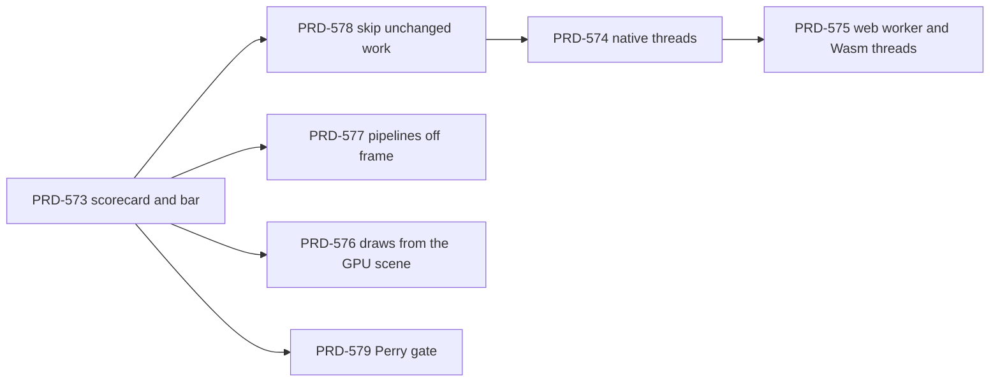

# Epic — Unreal-class performance

**Status: OPEN — filed 2026-10-09 against `origin/develop` at `708612e12`. The engine code these PRDs
change is on `origin/feat/native-engine` at `76989167f`. All seven PRDs are NOT STARTED.**

## The goal

ThreeNative reaches the frame cost and load time of a production engine on native desktop and
Android, and the best frame cost and load time on browser WebGPU. The engine is the one C++ engine
behind the Three.js API: native on Dawn or wgpu, and Wasm (`tn-native-engine-web`) on the web. Game
code runs on V8 or browser JS today (decision 12 in `docs/architecture/NATIVE-ENGINE-DECISION.md` on
`origin/feat/native-engine`), and Perry stays a gated option (decision 11, with its stopping rule).

## The bar

No Unreal binary runs on this machine, so "Unreal-class" cannot be a ratio against Unreal. The bar is
a scorecard of absolute numbers and same-run ratios on named scenes and devices. PRD-573 defines it
and records the baseline. The proposed numbers are an owner decision, open in PRD-573.

Where Midway stands today (the Midway web profile that opened this epic, native Wasm page against the
three.js page):

| Metric | Native / three.js |
| --- | --- |
| Steady-state CPU busy per frame | 2.32x faster |
| Frame p50 | 0.24x |
| First frame | 0.48–0.62x |
| `enter` | 0.96–1.09x |
| `ready` | 0.73–1.05x |

The steady-state frame splits into Wasm 59.1%, JS glue 27.8% and Wasm-to-JS calls 9.8%, with 812
engine calls per frame. Inside the engine: animation about 13% (`AnimationMixer` 11.9%), cull and
project about 11% (`ProjectedCull::apply` 5.9%, `RenderDatabase::project` 5.4%), `Renderer::render`
21% inclusive, transforms about 8%, and `std::__shared_weak_count::lock()` 2.9%.

## Rules for every PRD in this folder

- **Same-run ratio rule.** Host load on the development machine is high, so an absolute millisecond
  number is context only. A performance box claims a ratio from one run: subject and control run in
  the same command and the same load window (`pnpm profile:wasm-page -- --url A --control B`, or
  several `pnpm bench:engines` arms in one invocation). An engine change compares the new build
  (subject) with the base build (control), served side by side. Each report records the one-minute
  load average. A counter gate (calls, compositions, evaluations) is preferred over a timing gate
  where a counter can hold the claim, because a counter does not move with host load.
- **Visual judge.** A change that can alter a pixel follows the visual judge rule in the root
  `AGENTS.md`: same pose before and after, headed `--browser-recipe webgpu`, `adapter.info` checked,
  a fresh read-only judge subagent, and the verdict in the box that claims the outcome.
- **Red-green** for every behaviour change: a ctest or vitest case that fails before the change.
- **Bindings.** A change to the public binding surface regenerates the registry and catalog in the
  same commit (`packages/three-native/api/`).
- **Unreal licence.** Unreal Engine source is under the Epic Games EULA, and ThreeNative is MIT.
  Read the design, then write new code. Copy no code, shader or comment. A citation such as
  `UE 5.8.3: Engine/Source/Runtime/Renderer/Private/GPUScene.cpp` names a design reference, not a
  copy. The paths were read on the `release` branch at commit `396c9f059` (UE 5.8.3).
- **Where the work lands.** The engine lives on `feat/native-engine` until it merges to `develop`.
  An implementation PR targets the branch that carries the engine files it changes.

## Quick wins (owner instruction, 2026-10-09)

Only quick wins of a few hours join the current goal. Each PRD carries an `**Estimate:**` line. A box
marked **[QW ≤4 h]** fits in four hours or less and shows a measured gain on Midway web or native
desktop. All of them are in PRD-578, PRD-576 or PRD-577.

| Rank | Quick win | PRD | Hours | Gain ceiling | Pixels change |
| --- | --- | --- | --- | --- | --- |
| 1 | `PropertyBinding` applies without a `weak_ptr` lock per call | [PRD-578](./PRD-578-the-engine-skips-work-that-did-not-change.md) | 2–3 | up to the 2.9% lock share | no |
| 2 | An unchanged transform does not compose again | [PRD-578](./PRD-578-the-engine-skips-work-that-did-not-change.md) | 3–4 | part of the 8% transform share | no |
| 3 | A rig that no pass drew last frame evaluates at a lower rate | [PRD-578](./PRD-578-the-engine-skips-work-that-did-not-change.md) | 4 | part of the 13% animation share | yes (off-screen shadows): judge |
| 4 | The shadow pass replays a render bundle | [PRD-576](./PRD-576-the-engine-renderer-draws-from-the-gpu-scene.md) | 3–4 | WebGPU calls per frame fall (counter); the size depends on Midway's shadow draw count (unverified) | no |
| 5 | Warm-up creates pipelines asynchronously | [PRD-577](./PRD-577-engine-pipelines-compile-off-frame-and-survive-relaunch.md) | 4 (native desktop half) | first-render compiles fall to 0 (counter); the time gain is unverified until Phase 3 | no |

## Dependency order

The quick-win boxes in PRD-578 and PRD-577 do not wait for PRD-573: each one carries its own same-run
ratio. PRD-573 waits for no other PRD.

## The PRDs

| PRD | Outcome | Status |
| --- | --- | --- |
| [PRD-573](./PRD-573-the-performance-bar-is-a-scorecard-on-named-scenes.md) | One scorecard command reports frame, load and memory on named scenes; the bar is set | NOT STARTED |
| [PRD-574](./PRD-574-native-frames-overlap-game-and-render-work-on-threads.md) | Native game and render work overlap on separate threads, if the measurement earns it | NOT STARTED |
| [PRD-575](./PRD-575-the-web-engine-renders-from-a-worker-on-wasm-threads.md) | The web engine renders from a worker on Wasm threads, and the web limits are measured | NOT STARTED |
| [PRD-576](./PRD-576-the-engine-renderer-draws-from-the-gpu-scene.md) | The engine renderer draws from the GPU-scene kernel and replays static draws | NOT STARTED |
| [PRD-577](./PRD-577-engine-pipelines-compile-off-frame-and-survive-relaunch.md) | Engine pipelines compile asynchronously and persist on native | NOT STARTED |
| [PRD-578](./PRD-578-the-engine-skips-work-that-did-not-change.md) | The engine skips locks, compositions and evaluations that did not change | NOT STARTED |
| [PRD-579](./PRD-579-perry-earns-its-place-on-a-midway-shaped-workload.md) | Perry is judged on a Midway-shaped workload under decision 11's stopping rule | NOT STARTED |

## Owned elsewhere — link, do not file again

- **The JS-to-Wasm boundary and upload bytes:** PRD-553 (`docs/PRDs/native-engine/PRD-553-native-templates-multiple-times-faster.md`
  on `origin/feat/native-engine`) owns engine calls per frame, call batching, the `enter` gap and the
  ready-time upload bytes (242.6 MB native against 114.8 MB three.js). No PRD here files that work.
- **Perry facade gaps and the synthetic three-arm gate:** [PRD-530](../native-engine/PRD-530-n17-strict-native-typescript-game-packaging.md)
  Phase 4 and [PRD-533](../native-engine/PRD-533-n20-platform-qualification-performance-default-promotion.md)
  (`bench:engines --target web --arms current,wasm-js,wasm-perry`).
- **Engine batching, visibility, LOD and the GPU-scene kernel:** [PRD-519](../native-engine/PRD-519-n12-native-batching-visibility-lod-gpu-scene.md),
  including clustered LOD bands.
- **Animation rate policy in core TypeScript:** PRD-570 in the Unreal-source borrowing batch
  (commit `9d4b2a67f`). PRD-578 ports only its not-rendered rate into the engine.
- **Occlusion culling (HZB):** declined twice on measurement, in [PRD-284](../done/nanite-like/PRD-284-the-frame-does-not-draw-what-the-frame-already-hid.md)
  and [PRD-489](../open-world/PRD-489-gpu-scene-occlusion-culling.md) (median would-cull share 0.013).
- **Pipelines on the legacy host:** [PRD-327](../performance/critical/PRD-327-first-use-pipeline-compilation-leaves-the-main-loop.md),
  [PRD-387](../performance/critical/PRD-387-shader-variants-are-prepared-off-frame-and-bounded.md) and
  [PRD-339](../performance/critical/PRD-339-the-compile-walk-leaves-the-main-thread.md). PRD-577 covers the engine's own `PipelineCache`.
- **Texture residency and compression:** [PRD-VQ-10](../performance/PRD-VQ-10-texture-mip-residency.md) and PRD-568 (borrowing batch).
- **Frame-rate floors per platform:** [PRD-222](../performance/critical/PRD-222-performance-targets-per-platform.md).
