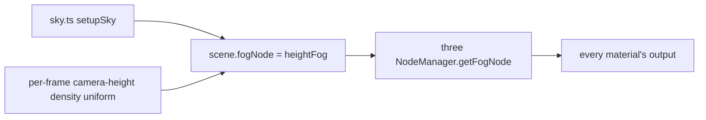

# PRD-560 — Height fog follows the ground, and the sun shows through it

**Status:** PARTIAL — the stronger fog matches the locally saved IMPROVEMENT captures; its template runtime gates, root typecheck, evidence upload and the Pixel 8 cost check remain open
**Priority:** P2 — before this PRD, 11 of 13 templates shipped distance-only fog, so no default scene had ground mist or a sun-side horizon.
**Complexity:** 3 (LOW) — 11+ template files (3), no new module, no package change; risk override: none
**Owner:** João
**Depends on:** None. Keeps the stream-edge guarantee of [PRD-461](../done/open-world/PRD-461-view-distance-basics.md) (done) and coexists with the starter mist from [PRD-VQ-07](../done/PRD-VQ-07-volumetric-fog.md).

## Context

Eleven templates set `scene.fog = new FogExp2(colour, density)` in `src/render/sky.ts`: starter,
action-rpg, minimal, platformer, puzzle, racing, rts, runner, sailing, shooter and snow
(`rg -l FogExp2 packages/create-threenative/templates/*/src/render/sky.ts`, 2026-10-09).
Tower-defense uses linear `Fog`. Rain sets no fog.

`FogExp2` reads only the distance to the fragment. So:

- A valley and a ridge at the same distance get the same haze. A scene has no ground mist.
- The fog colour is one palette constant. The horizon toward the sun and the horizon away from it
  are the same colour.

A streaming game's distance fog carries a guarantee that this PRD must keep.
[PRD-461](../done/open-world/PRD-461-view-distance-basics.md) (DONE, PR #470) ships game-owned linear
fog that is opaque at the prop ring, so the stream edge is never visible. The rule is "fog `far` ≤
`ring · cellSize`", and the ground must end beyond it (`docs/guides/world-streaming.md:143-170`). The
example's source is `examples/abyss-framework/src/render/worldFog.ts`. A height term that replaced
that distance term would leave the stream edge bare wherever the view ray stays above the fog layer:
a ridge, or a camera in flight.

three 0.185.1 ships `exponentialHeightFogFactor` (`three/src/nodes/fog/Fog.js:73-82`). It is not the
physical integral: it multiplies the fragment's depth below a height by the view depth. A fragment
above that height gets no fog, even when the view ray crosses the dense layer. It also ignores the
camera height.

### What Unreal does (UE 5.8.3, read 2026-10-09)

Unreal's exponential height fog is a closed-form line integral, not a ray march:

- Density falls off exponentially with height above a fog height. The integral of that density
  along the straight camera-to-fragment ray has a closed form: the density at the camera, times
  `(1 - 2^-(falloff * rayDeltaZ)) / (falloff * rayDeltaZ)`, times the ray length. When the ray is
  nearly horizontal the quotient goes to 0/0, so a first-order Taylor term replaces it. The exponent
  is clamped at -127 so `exp2` stays finite.
  `UE 5.8.3: Engine/Shaders/Private/HeightFogCommon.ush:205-213`.
- The density at the camera does not change across the frame, so the CPU computes it once per frame.
  The CPU also clamps the camera height relative to the fog height and clamps the exponent to the
  float range, for precision. `UE 5.8.3: Engine/Source/Runtime/Renderer/Private/FogRendering.cpp:370-405`.
- Transmittance is `exp2(-integral)`, floored by `1 - maxOpacity`. A cutoff distance turns fog off
  past a range, so the sky is not fogged twice.
  `UE 5.8.3: Engine/Shaders/Private/HeightFogCommon.ush:394-407`.
- Directional inscattering adds the sun colour, weighted by
  `pow(saturate(dot(viewDir, sunDir)), exponent)`. It integrates the same density, but only over the
  part of the ray past an inscattering start distance. So the sun glow is a distant-haze effect and
  does not tint nearby objects.
  `UE 5.8.3: Engine/Shaders/Private/HeightFogCommon.ush:355-368`.
- Component defaults: density 0.02, height falloff 0.2, max opacity 1, start distance 0,
  inscattering exponent 4, inscattering start distance 100 m (10000 UE units).
  `UE 5.8.3: Engine/Source/Runtime/Engine/Private/Components/ExponentialHeightFogComponent.cpp:80-98`.
  Unreal works in centimetres. This PRD recalibrates the values in metres against each template's
  current eye-level haze. It does not copy them.

The fragment cost is two `exp2` calls, one division and one `pow`. There is no march, no texture and
no extra pass.

## Solution

**The look ships as generated source** (rule 1(b)): the fog decides how the scene looks, so each
template's `src/render/sky.ts` owns it. Nothing changes in `packages/`.

- **The height term adds to the distance term and never replaces it.** The final transmittance is
  `T_distance × T_height`. `T_distance` is the game's existing distance fog: the template's current
  `FogExp2` curve through three's `densityFogFactor`, or a streaming game's linear near/far through
  `rangeFogFactor`. Both are exported from `three/tsl` (`three/src/nodes/fog/Fog.js:40, 57`). The
  product is never more transparent than either factor alone. So wherever `T_distance` reaches 0,
  at fog `far` and at the prop-ring corner, the frame stays fully fogged, and the PRD-461 guarantee
  holds unchanged. The sun-inscatter colour mixes in with the same combined opacity.
- `sky.ts` builds a TSL fog node and assigns it to `scene.fogNode`. three's `NodeManager.getFogNode`
  (`three/src/renderers/common/nodes/NodeManager.js:578`) applies `scene.fogNode` per material, in the
  same place `FogExp2` applies today. Transparent materials receive fog, and the background does not.
- The node computes the closed-form integral above, with the Taylor fallback and the exponent clamp,
  in metres. A per-frame uniform carries the camera-height density term. The sun lobe uses the
  template's existing `SUN_DIRECTION`. The non-directional colour is the template's current fog
  colour (for example `palette.skyLow`), so the eye-level look does not change.
- The named controls in `sky.ts` are: `density`, `heightFalloff`, `fogHeight`, `maxOpacity`,
  `startDistance`, `sunExponent`, `sunStartDistance` and `cutoffDistance`. Each control has a
  comment that says which way to move it. The pure math is exported from `sky.ts`, so a node-env
  spec can check it.
- Each template keeps its current eye-level haze. At camera height and the current reference
  distance, the combined transmittance matches the old `FogExp2` transmittance within 2%. The
  `FogExp2` density is lowered to make room for the height term at eye level. It is never removed.
- **Coexistence with the starter mist:** `STARTER_MIST` already owns the fog while it is enabled
  (starter `AGENTS.md`). Height fog yields to it the same way `FogExp2` does today. Only one fog owner
  exists at a time.

Risks:

- three may not apply `scene.fogNode` on a node material that sets its own `fog: false`. Phase 1
  checks the starter's materials.
- The native host must compile the same TSL fog node. Phase 2 proves it on the desktop target.

## Acceptance Criteria

- [x] AC-1a [local]: In the scaffolded starter, the height-fog frame is judged at or above the `FogExp2` frame by a fresh judge. proof: same-pose before/after captures (2 runs per arm, three poses: default, high, ridge; 1920x1080, headed, `--browser-recipe webgpu`, adapter `nvidia`/`turing`) given to a fresh read-only judge subagent with the intended effect — verdict 2026-10-09 on `density: 0.0012`: no regression in any of the three poses; re-judged 2026-10-10 on the shipped `density: 0.0018` with a fresh judge: default NEUTRAL, high NEUTRAL, ridge IMPROVEMENT, no new artefact. `pnpm visuals:ab` was not run: the fresh-judge protocol replaced it.
- [x] AC-1b [local]: Low ground reads hazier than a ridge at the same distance. proof: same-pose captures and a fresh read-only judge, 2026-10-10 — verdict IMPROVEMENT on the ridge pose ("the raised cube is a clearly deeper, more saturated red and the ground cube is lighter and less saturated"; difference "clearly visible, moderate, not dramatic") and IMPROVEMENT overall; default and high poses NEUTRAL, no artefact. Measured, not graded: mean saturation of the low block vs the high block is 0.491 vs 0.603 with height fog and 0.407 vs 0.404 with `FogExp2`. The first judge on `density: 0.0012` returned "unclear, leaning intended" (saturation 0.461 vs 0.516), which is NEUTRAL under the owner rule, so the cause was fixed (see Decisions) and a fresh judge ran again. Unit proof: `pnpm exec vitest run packages/create-threenative/__tests__/height-fog.spec.ts` — 23/23; the new per-kit "ridge contrast" spec reads 0.052 (fails) at density 0.0012 and passes at 0.0018.
- [ ] AC-2 [local]: At 1080p on the RTX 2080 browser WebGPU lane, height fog costs at most 0.1 ms GPU more than `FogExp2` in the same starter build. proof: same-page interleaved A/B (`scene.fogNode` toggled every `TN_FRAME_BUDGET` window of 100 frames, scratch driver, two runs of 14 windows, warm-up window dropped) — `gpuMain` p50 mean 0.433 ms with height fog vs 0.464 ms without (delta -0.03 ms, medians 0.4 vs 0.4; run 1 -0.07 ms, run 2 +0.01 ms), 2026-10-09, at `density: 0.0012` only. Current `density: 0.0018` cost is unverified and needs the same interleaved measurement. The off arm is `FogExp2` at the lowered density. Caveat: the GPU is shared and loaded, and `gpuMain` has a 0.1 ms quantum. Separate before/after builds gave unusable runs (fps 2 to 7 under load), so the toggle replaced them.

## Integration Ledger

| Capability | Reachable consumer/trigger | Replaces / disposition | Evidence |
|---|---|---|---|
| Height fog | scaffolded game → `setupSky()` in `templates/*/src/render/sky.ts` → `scene.fogNode` → three `NodeManager.getFogNode` → every material | Moves the `FogExp2` term of 11 templates into the node as `T_distance`, unchanged in shape. Tower-defense linear `Fog`, rain's no-fog and the PRD-461 streaming recipe stay unchanged. | AC-1, AC-2, Phase 1, Phase 3 |

## Execution Phases

#### Phase 1: Height fog in the starter
**Status:** IN PROGRESS (2026-10-10)
**Files:** `packages/create-threenative/templates/starter/src/render/sky.ts`, `packages/create-threenative/templates/starter/src/render/heightFog.ts` (new: the template `__tests__/template.spec.ts` render-export rule needs each exported maths symbol to have a caller in another file, so the maths moved out of `sky.ts` and `sky.ts` keeps the look numbers), `packages/create-threenative/__tests__/height-fog.spec.ts` (new)
**Implementation:** Write the integral as a pure function, then the TSL node that uses it, and assign the node to `scene.fogNode`. Calibrate `density` and `heightFalloff` to the current eye-level haze.
- [x] The closed form matches a 4096-step numeric march within 1% for camera heights below, inside and above the layer, for rays from -89° to +89°, at exactly horizontal (the Taylor branch), and at the exponent clamp. proof: `pnpm exec vitest run packages/create-threenative/__tests__/height-fog.spec.ts` — 5/5 pass, 2026-10-09. The clamp case asserts finite and fully opaque, not equality: Unreal clamps the camera term only, so a march that clamps per sample differs by design.
- [x] The combined transmittance is never above the distance term alone. With PRD-461's recipe (linear near 128 m, far 256 m), it is 0 at fog `far` for a camera far above the layer. proof: `pnpm exec vitest run packages/create-threenative/__tests__/height-fog.spec.ts` — same 5/5 run.
- [ ] The current `density: 0.0018` starter template gate passes with height fog on, and the mist-enabled arm shows one fog owner. proof: the starter is not in `pnpm test:templates` (it is booked by the golden path), so its four scaffolded scenarios `play`, `survives`, `production-readiness` and `fog` ran on both arms with `--browser-recipe webgpu --headed` — height-fog arm 4/4 exit 0; mist arm (`STARTER_MIST.enabled = true`) 4/4 exit 0 on rerun (the first `play` run failed `maxFrameMsP95` at 52.4 ms with host load near 30 and passed twice at load below 13). A scratch probe of `scene.fog` and `scene.fogNode` after the post graph builds read `{fog: true, fogNode: true}` with mist off and `{fog: false, fogNode: false}` with mist on, and neither arm logged a console error, 2026-10-09, with `density: 0.0012` only. Current `density: 0.0018` gameplay and mist gates remain unverified; the twelve visual captures do not prove these scenarios.

#### Phase 2: Native
**Status:** IN PROGRESS (2026-10-10); the phone-cost check remains under `## Blocked on`
**Files:** none beyond Phase 1, unless a defect needs a fix
- [ ] The desktop native host renders the current `density: 0.0018` starter with height fog and a non-blank screenshot. proof: `node scripts/verify-starter-desktop.mjs --project . --frames 300` in a scaffolded starter built with `pnpm build:desktop` — "starter desktop gate passed: 300 frames, 2674 colors, 485 asset pixels"; the `FogExp2` control arm passes with 2590 colors, so the TSL fog node compiles in the owned host (RTX 2080, 2026-10-09, `density: 0.0012` only). This demonstrates the earlier shader mechanism; current `density: 0.0018` native rendering has not been rerun. The starter's `survives` scenario cannot hold this claim on `--target desktop`: its default network diagnostics return `TN_PLAYTEST_UNSUPPORTED_ON_TARGET` there, so the starter's own native gate is the proof.

#### Phase 3: Every FogExp2 template
**Status:** PARTIAL
**Files:** `src/render/sky.ts` in action-rpg, minimal, platformer, puzzle, racing, rts, runner, sailing, shooter, snow; each template's `AGENTS.md` (and mirrors)
- [x] Eight of the ten other templates (action-rpg, minimal, puzzle, racing, rts, runner, sailing, snow) use height fog, each within 2% of its old eye-level transmittance, and their template gates pass. proof: `pnpm exec vitest run packages/create-threenative/__tests__/height-fog.spec.ts` (eye-level spec over all 11 kits, 32/32 with the doc specs) and `TN_TEMPLATE_ONLY=<template> pnpm test:templates` on the RTX 2080 lane, 2026-10-09 to 2026-10-10 — pass for minimal, sailing and rain on the first run; puzzle, racing, rts, runner, action-rpg and snow passed on rerun. The first runs failed only `performance.maxFrameMsP95` (36.9 to 81.3 ms, host load 20 to 47 from other jobs), one Xvfb start timeout (runner) and one GPU device-lost (action-rpg). Unchanged tower-defense failed the same assertion in the same window (46.8 ms), and base templates from 6b18d913e failed action-rpg (36 ms plus 3 console errors) and shooter (90.8 ms) there too, so the failures belong to the lane.
- [ ] The shooter and platformer template gates pass with height fog. proof: the PR's CI template jobs (shooter on a quiet runner; platformer through its golden journey, because `test:templates` excludes it).
  Open: platformer's gate did not run locally. 33 of 34 shooter scenarios pass; `performance` fails `performance.maxFrameMsP95` at 52.2 ms (58.2 and 61.8 ms on two earlier runs; the base templates read 90.8 ms in the same lane). It needs a quiet GPU or CI's runner; the change is not its cause.
- [x] Each template's `AGENTS.md` names the fog controls and the mist ownership rule, and the mirrors are in sync. proof: `pnpm sync:agents --check && pnpm exec vitest run scripts/__tests__/primary-docs.spec.ts scripts/__tests__/sync-agent-docs.spec.ts`. — "agent docs in sync: 23 CLAUDE.md mirrors"; primary-docs and sync-agent-docs specs pass, 2026-10-10.
- [ ] After raising density to 0.0018, the five gates named by `gates2.sh` pass: action-rpg, minimal, runner, sailing and shooter. proof: `TN_TEMPLATE_ONLY=<template> sh scripts/xvfb.sh pnpm exec tsx scripts/verify-template-playtests.ts`. The existing run has minimal and sailing exit 0; action-rpg exit 1 (inventory diagnostics not evaluated, GPU device loss, p95 49.7 ms > 33 ms), runner exit 1 (p95 59.6 ms > 33 ms), shooter pending. Logs: `/home/joao/.cache/prd-560-work/tt2/`. The earlier eight-kit proof above predates the stronger density; it does not complete this box. No retry after two frame-time failures on the loaded host.

## Blocked on

- Pixel 8 main-pass cost: the height-fog starter costs at most 0.2 ms more than the `FogExp2` build. proof when run: `node packages/playtest/dist/runner/cli.js perf --logcat <serial>` on both Android builds. João must grant the Pixel (shared device lane); an emulator cannot hold a phone-GPU claim.

## Decisions

- 2026-10-10 (workflow inspection): `ci.yml` accepts pushes only to main/develop and skips the board for draft PRs; PR #482 targets develop and carries only `prd:75%`, so `native-release.yml` also refuses its expensive proof (requires main or `release-proof`). No push, ready, rebase, merge, dispatch or deploy was performed. A later merge of these template files into develop will trigger `site-docs.yml`, which dispatches the site's deployment workflow; keeping this run local avoids that trigger.
- 2026-10-10 (resume verification): keep the Pixel 8 cost under `Blocked on`; João owns the shared device grant, and no phone cost was measured. PR #478 is still OPEN, so no parent hashes were regenerated, and PR #482 remains draft. Existing local hash edits passed `scaffold.spec.ts`; integration after #478 still needs its final parent hashes.
- 2026-10-10 (resume verification): the starter's current `heightFog.ts`, `sky.ts` and `palette.ts` exactly match `/home/joao/.cache/prd-560-work/after-starter/src/render/`; the captured build contains density 0.0018. The arms have identical camera, scene and scenario sources; all 12 reports in `final/` pass at 1920x1080 on nvidia/turing, with two runs per arm per pose. All 12 `final/labelled/` images retain BEFORE/AFTER banners. The fresh-judge IMPROVEMENT handoff is `pr-comment2.md` in that same cache. Reused these captures without a new capture or judgement. The twelve existing comparisons are now on screenshot commit `487dccda66517e9975607cd780a1aef41fec49da`; its evidence-only push used the documented `TN_SKIP_PREPUSH=1` escape hatch after the product drift hook rejected the first upload. No product-source branch was pushed.
- 2026-10-10 (resume checks): `pnpm exec vitest run packages/create-threenative/__tests__/height-fog.spec.ts packages/create-threenative/__tests__/scaffold.spec.ts packages/create-threenative/__tests__/template.spec.ts scripts/__tests__/primary-docs.spec.ts scripts/__tests__/sync-agent-docs.spec.ts` passes 143/143 in 56.92 s, including pristine compiler checks for every template. `pnpm --filter create-threenative typecheck`, `pnpm check:docs` (3025 links), `pnpm sync:agents --check` (25 mirrors) and Biome on the nine dirty TypeScript files pass. Logs: `/tmp/prd560-{focused-gates,package-typecheck,check-docs,sync-agents,biome}.log`. Root `pnpm typecheck` fails at `examples/strata-terrain-preview/src/render/horizon.ts`: missing `../world/horizon.json` and consequent unknown types; no unrelated repair attempted (`/tmp/prd560-typecheck.log`). Laptop status refused work at 100°C, then 98°C; short deterministic checks ran locally while the already-running template job was preserved.
- 2026-10-10 (measurement scope correction): the -0.03 ms browser cost and desktop native screenshot predate the retune and cover `density: 0.0012` only. Current `density: 0.0018` browser cost and native rendering remain open; unchanged instruction count does not establish measured cost. No new visual judgment ran because the user-requested Claude visual-judge skill could not be located. Keep the PR draft for user inspection; no archive or merge.
- 2026-10-10 (agent, on a NEUTRAL judge): AC-1b read "unclear, leaning intended" at `density: 0.0012`. The cause was the split of the kept eye-level haze: the height term carried 60% of it and the identical distance term hid the difference at 330 m (5 points of opacity). A grid over `density` and `heightFalloff` showed `heightFalloff` near 0.08 is already the best value (0.05 and 0.12 both lose), and that a larger height share is what widens the gap. The seven kits whose old fog was `FogExp2` 0.003 at 150 m from 2 m up (starter, minimal, platformer, action-rpg, runner, shooter, sailing) now ship `density: 0.0018` (about 84% of that haze in the height term; the distance term stays, so the ground still ends in fog at a kilometre: 93% at 1 km). Racing already carries 86% at 0.0012, rts looks from 20 m, snow's fog is a 40 m blizzard and puzzle's is 12 m, so those four keep their values. Cost: at 330 m the total haze is lighter than the old quadratic fog (42% against 62% at 330 m along the horizon, because the height term grows linearly with distance); the eye-level haze at 150 m still matches within 2%. Rejected: raising `heightFalloff` (it lowers the ground cube's haze as much as the ridge's), and a pose with the camera above the layer (no mist to see there).
- 2026-10-10 (agent): the Phase 2 desktop proof names `scripts/verify-starter-desktop.mjs`, because the starter's `survives` scenario returns `TN_PLAYTEST_UNSUPPORTED_ON_TARGET` for its network diagnostics on `--target desktop`.
