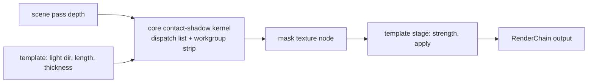

# PRD-561 — Small things touch the ground: contact shadows from screen depth

**Status:** IN PROGRESS — dispatch builder and its spec landed; the GPU kernel is unproven until a WebGPU run
**Priority:** P2 — AC-1 to AC-3 are open: no template has a screen-space contact shadow, and the platformer fakes one with a blob mesh.
**Complexity:** 5 (MEDIUM) — 1–5 implementation files (1), new mechanism module (+2), a compute pass with workgroup memory and a CPU-built dispatch list (+2); risk override: none
**Owner:** João
**Depends on:** None

## Context

A shadow map cannot resolve the contact between a small object and the ground. Its texels are too
large, and its bias detaches the shadow from the caster. The templates show both symptoms:

- `templates/platformer/src/render/fox.ts:147-155` draws a 0.42 m `CircleGeometry` blob under the fox,
  because "the shadow map's own shadow is easy to lose" on a bright grass cap.
- `templates/puzzle/src/render/lighting.ts:48-50` tunes `normalBias` so that bias does not "detach the
  contact shadow under every crate". The bias trade-off still exists.

The repository has no screen-space contact shadow (`rg -i "contact.?shadow|screen.?space.?shadow"` in
`packages/core/src` and every template's `src/render/`, 2026-10-09). This also serves the convention
"feet meet the floor": the feet touch the floor, but no shadow shows the contact.
[PRD-344](../rendering/PRD-344-contact-occlusion-baked-from-the-geometry-it-ships-with.md) bakes occlusion into
procedural geometry creases. That is static self-occlusion, not a dynamic shadow from a light, so
this PRD does not overlap it.

### What Unreal does (UE 5.8.3, read 2026-10-09)

- Unreal ships two contact-shadow methods: a stochastic jittered screen trace (method 0, the default)
  and **Bend Studio's Screen Space Shadows** (method 1).
  `UE 5.8.3: Engine/Source/Runtime/Renderer/Private/Shadows/ScreenSpaceShadows.cpp:25-33`. Contact
  shadows are off for each light by default (`ContactShadowLength = 0`).
  `UE 5.8.3: Engine/Source/Runtime/Engine/Private/Components/LightComponent.cpp:470-473`.
- Bend SSS is third-party code under **Apache-2.0** (`Engine/Shaders/Private/bend_sss_gpu.tps`,
  `Engine/Source/Runtime/Renderer/Private/Shadows/bend_sss_cpu.h:3-15`). Its upstream is Bend Studio's
  own release, linked from https://www.bendstudio.com/blog/inside-bend-screen-space-shadows/.
  **This PRD ports the upstream release, never the copy in the Unreal tree.**
- The algorithm, in our words:
  1. The CPU projects the light into screen space. It splits the screen into at most 8 dispatches,
     wedges that radiate from the light's screen point. When the light is behind the camera
     (projected `w` sign), the trace direction reverses.
     `UE 5.8.3: Engine/Source/Runtime/Renderer/Private/Shadows/bend_sss_cpu.h:38-48, 73-170`.
  2. Each 64-thread group handles one 64-pixel line toward the light. It loads a strip of depth
     samples into workgroup memory once. Then each pixel walks the shared strip toward the light, and
     counts a hit where a sample is in front of it within a fixed surface thickness. The defaults are
     60 samples, the first 4 hard (not averaged), the last 8 faded, and a thickness of 0.005 in
     Unreal's override. `UE 5.8.3: Engine/Shaders/Private/bend_sss_gpu.ush:36-54, 242-249`.
  3. A group whose pixels all fall outside the light's depth bounds exits early. The early exit uses
     wave operations when the hardware wave size matches, and falls back to workgroup memory and
     barriers when it does not. `UE 5.8.3: Engine/Shaders/Private/bend_sss_gpu.ush:370-391`.
  4. Unreal writes the result into the light's screen shadow mask, so it darkens only that light's
     direct term. `UE 5.8.3: Engine/Source/Runtime/Renderer/Private/Shadows/ScreenSpaceShadows.cpp:226-234, 467-521`.
- WebGPU differences that this PRD must handle:
  - WebGPU core has no wave operations. The workgroup-memory fallback in step 3 is therefore the
    only path.
  - WebGPU has no clamp-to-border sampler. Bend expects one (`bend_sss_gpu.ush:160`), so the kernel
    bounds-checks its depth reads.
  - three renders forward, so no shadow-mask texture exists before shading. See the first design
    decision below.

## Solution

**The split, by the repository's two questions:**

- *(a) Could a game write this portably?* Yes. It needs only a depth texture, a compute pass and
  TSL. But the dispatch-list builder and the workgroup-memory kernel are plumbing that every game
  would repeat, and they decide nothing about the look. That is the mechanism row of "Where a change
  goes".
- *(b) Does it decide how anything looks?* The strength, length, thickness, fade, which light, and
  where the mask is applied all do.
- So the split follows the shape of `GPUParticles3D`:
  - `packages/core/src/render/contact-shadow.ts` (new) owns the dispatch list and the kernel. It
    takes depth, a camera and a light direction, and returns a mask texture node. Every appearance
    parameter comes from the caller, and the module sets no default look.
  - Each template's `src/render/` decides whether to use the mask, how to apply it, and every
    strength value.
  - The port keeps its Apache-2.0 header in the file. `packages/core/THIRD_PARTY_NOTICES.md` (new)
    carries the licence text and ships in the published package.

**First design decision (Phase 1 records it under `## Decisions`):** where the mask applies.

- **Arm A, post stage.** A `contactShadows` render-chain stage multiplies the lit colour by the mask
  after the scene pass, using current-frame depth. This is the cheapest arm. It also darkens ambient
  light, which reads like ambient occlusion over the short default length.
- **Arm B, light term.** The sun's shadow node samples the mask, so only direct light darkens. This
  matches Unreal. three renders forward, so this arm needs a depth prepass or reprojected
  previous-frame depth.
- Arm A ships unless the judge rejects it on the PRD-345 dark-environment fixture. The stage name
  enters `RENDER_CHAIN_STAGE_ORDER` in `packages/core/src/render/chain.ts`, before `ambientOcclusion`.
  That is an ordering mechanism only.

**Consumers:** the platformer replaces its blob with the stage, and the starter enables the stage at
the `high` and `medium` tiers. A tier whose cost gate fails refuses the stage by name in
`TN_RENDER_CHAIN`, like the existing refusals in `worldEnvironment.ts`.

## Acceptance Criteria

- [ ] AC-1 [local]: In a platformer scenario, with the blob mesh removed and the stage on, the region under the standing fox's feet has a dark-pixel ratio at least 0.3. The same scenario fails with the stage off. proof: `node packages/playtest/dist/runner/cli.js playtests/contact-shadow.playtest.json --url <dev url> --browser-recipe webgpu` with a `region` `minDarkPixelRatio` assertion — Evidence: pending.
- [ ] AC-2 [local]: The stage costs at most 0.3 ms GPU at 1080p on the RTX 2080 browser WebGPU lane. proof: `TN_FRAME_BUDGET` p50 delta, stage on against stage off, from `node packages/playtest/dist/runner/cli.js perf` — Evidence: pending.
- [ ] AC-3 [local]: On the Pixel 8, the stage costs at most 0.5 ms GPU at the starter's mobile resolution, or the `low` tier refuses it by name. proof: `node packages/playtest/dist/runner/cli.js perf --logcat <serial>` stage on against stage off — Evidence: pending.

## Integration Ledger

| Capability | Reachable consumer/trigger | Replaces / disposition | Evidence |
|---|---|---|---|
| Contact-shadow mask | template `postprocessing.ts`/`worldEnvironment.ts` stage → `contactShadow()` from `@threenative/core` → compute dispatches → mask node | New mechanism | Phase 1, AC-2 |
| Contact-shadow stage | `renderer.createRenderChain()` with `contactShadows` in the canonical order | Replaces the platformer blob (`fox.ts:147-155`) | AC-1 |

## Execution Phases

#### Phase 1: Mechanism and the apply decision
**Status:** IN PROGRESS — box 1 done; the kernel runs on a GPU next, then the judge
**Files:** `packages/core/src/render/contact-shadow.ts` (new), `packages/core/src/render/chain.ts`, `packages/core/src/index.ts`, `packages/core/THIRD_PARTY_NOTICES.md` (new), `packages/core/src/render/contact-shadow-dispatch.ts` (new, the CPU dispatch builder), `packages/core/__tests__/contact-shadow-dispatch.spec.ts` (new), `docs/architecture/CHARTER.md`
- [x] The dispatch-list builder writes every on-screen pixel at least once, except the pixel under the light, for a light in front of, behind, beside and far off screen, and for viewports that are not multiples of 64. Overlap stays bounded (see `## Decisions`). proof: `pnpm exec vitest run packages/core/__tests__/contact-shadow-dispatch.spec.ts` — Evidence: 7 passed (1920x1080, 1001x577, 63x65, 1x1, 130x70, 1024x512, six light placements each; bounds case 301,203 to 700,510).
- [ ] Arm A or Arm B is chosen with the judge's verdict, and the choice is written under `## Decisions`. proof: `pnpm visuals:ab --before <arm A> --after <arm B> --raters 3` on the starter and the dark-environment fixture.
  Left open: the 2026-10-10 artifact-fix candidate is captured but UNJUDGED (see `## Decisions`).

#### Phase 2: Templates use it
**Status:** NOT STARTED
**Files:** `packages/create-threenative/templates/platformer/src/render/fox.ts`, `packages/create-threenative/templates/platformer/src/render/postprocessing.ts`, `packages/create-threenative/templates/starter/src/render/quality.ts`, `packages/create-threenative/templates/starter/src/render/worldEnvironment.ts` (stage only if the shared-source spec allows it, else the starter's own `postprocessing.ts`), `packages/create-threenative/templates/platformer/playtests/contact-shadow.playtest.json` (new)
- [ ] The platformer ships without the blob, and the template gate passes for the platformer and the starter. proof: `pnpm test:templates`.

#### Phase 3: Native
**Status:** NOT STARTED
**Files:** `packages/runtime-native/conformance/scenes/shared/contact-shadow.js` (new), `packages/runtime-native/conformance/registry.json`
- [ ] The desktop native host produces the same mask as the browser within tolerance for a fixed depth fixture and light. proof: `pnpm parity --target desktop --only-tests contact-shadow`.

## Decisions

- 2026-10-09 — **Coverage is "at least once", not "exactly once".** Emulating every (dispatch, group,
  thread) of the ported builder shows the 64-line fans overlap where they converge on the light and at
  tile seams: about 8% of pixels at 1080p are written twice, and the pixels next to the light up to 127
  times. Beyond one wave of the light a pixel is written at most twice, and every write carries the same
  value because each thread marches its own pixel. The pixel under the light is never written; it is the
  sun disc, not a surface. The PRD text said "exactly once", which the upstream algorithm does not give.
- 2026-10-09 — **One deliberate change from the upstream CPU builder.** Upstream makes the bounds
  relative to `round(light)` while the kernel measures from the centre of `floor(light)`. They differ by a
  pixel whenever the fraction is 0.5 or more, and the upstream sample hides it by passing `max = viewport
  size`. The emulation found it: a light at x = 38400 on a 1920-wide target left column 1919 unwritten.
  The port uses `floor(light)` for both and an inclusive `max = size - 1`, and rounds the light to float32
  so the CPU and the GPU agree on `floor`. The spec case "far off screen" at 1920x1080 is the red-green.
- 2026-10-10 — **Artifact-fix candidate: UNJUDGED, and no benefit shown over run-to-run noise.** Cause: the
  stage's reach was a constant 24 screen pixels, so its length in the world grew with distance (about
  53 cm at the fox, about 1.4 m at the castle) and, where the sun shadow-map texel is already narrower than
  a pixel, the term only added depth-edge hits: tower-rim dashes, porthole and silhouette halos, bridge-edge
  dashes and an ear-on-forehead gash on the fox. Candidate (both template stage files, no core change):
  reach 8 px, one hard sample, `contrast: 1`, and a `texelsPerPixel` gate read from the sun's shadow
  camera (map texel over pixel footprint) that hands pixels back to the map. Desktop WebGPU (NVIDIA Turing,
  headed), key-light map 1024 and 4096, two runs per arm, stage off against on, same pose, `BODY_REST` 0.377 in
  both arms. The author reported reduced castle, porthole, silhouette and bridge artifacts, with a short
  dash remaining at the fox's ear base; this is not a formal judgment. Pixel differences (fuzz 2%) were
  0.37% for feet versus 0.55% control run variation, and 1.0% for the fox versus 0.89% control variation.
  These measurements do not establish useful grounding; the candidate suppresses the effect on these
  poses and is parked. No visual verdict is assigned. The
  platformer's `contact-shadow.playtest.json` is green with the stage (the chain lists `contactShadows`)
  and red with it removed (`TN_PLAYTEST_RENDER_CHAIN_STAGES_FAILED`). No formal
  visual judge ran, so the D12 decline stands and no acceptance box is ticked. Open doubt: the premise
  (a map texel wider than the contact gap) holds only where the camera is far from the receiver and no
  template renders that.
